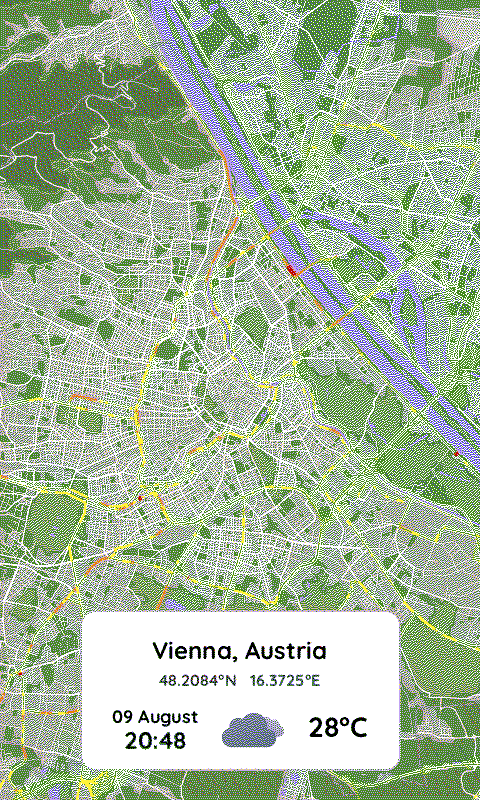

# Smart Dashboard Server

A comprehensive map generation system for e-paper displays that creates location-based maps with weather overlays, timezone information, and optimized formatting for ESP32-based smart dashboards. The system features a modular, refactored architecture for maintainability and extensibility.

## 🌟 Features

- **Location-based Map Generation**: Generate maps for any city/country using Mapbox
- **Weather Integration**: Real-time weather data and high-quality local icons
- **Timezone Awareness**: Automatic local time calculation using Geonames API
- **E-paper Optimization**: 7-color e-paper format with Floyd-Steinberg dithering
- **Smart Caching**: Location coordinates, timezone, and weather icon caching
- **Cross-platform Fonts**: Optimized font rendering with system fallbacks
- **Modular Architecture**: Clean, maintainable code structure with specialized modules
- **Binary Visualization**: Automatic e-paper preview generation in workflow
- **Complete Workflow**: One command generates PNG, binary, and visualization files

## 🏗️ Architecture

The server is organized into specialized modules for clean separation of concerns:

```
Server/
├── main.py                          # Main entry point
├── map_generator.py                 # Core orchestration class
├── config/                          # Configuration management
│   ├── __init__.py
│   └── settings.py                  #   - Centralized settings & API keys
├── data_providers/                  # External data handling
│   ├── __init__.py
│   ├── weather.py                   #   - OpenWeatherMap & local icons
│   └── geolocation.py               #   - Mapbox geocoding & Geonames timezone
├── image_composition/               # Image creation & manipulation
│   ├── __init__.py
│   ├── overlay.py                   #   - Information overlay creation
│   └── fonts.py                     #   - Cross-platform font management
├── utils/                           # Utility functions
│   ├── __init__.py
│   ├── file_converter.py            #   - High-level e-paper conversion
│   ├── png_to_epaper_converter.py   #   - Direct PNG to e-paper conversion
│   ├── epaper_visualizer.py         #   - Binary to PNG visualization
│   └── icons/                       #   - Local weather icon PNG files
│       ├── 01d.png ... 50n.png     #     (18 weather condition icons)
│       └── Weather_icons.pdf
├── map_providers/                   # Map data sources
│   ├── __init__.py
│   └── mapbox.py                    #   - Mapbox integration & styling
├── fonts/                           # Font files
│   └── Quicksand-VariableFont_wght.ttf
├── Maps/                            # Generated map outputs
└── smart_dashboard_server/          # Virtual environment
```

## 🚀 Quick Start

### Prerequisites

1. **Python 3.9+** with virtual environment support
2. **Mapbox API Key** (free at [mapbox.com](https://account.mapbox.com/))
3. **OpenWeatherMap API Key** (optional, for weather data)
4. **Geonames Username** (free at [geonames.org](https://www.geonames.org/export/web-services.html))

### Installation

1. **Setup Environment**:
   ```bash
   cd Server/
   python -m venv smart_dashboard_server
   smart_dashboard_server\Scripts\activate  # Windows
   # source smart_dashboard_server/bin/activate  # Linux/Mac
   ```

2. **Install Dependencies**:
   ```bash
   pip install requests pillow numpy pytz geopy python-dotenv
   ```

3. **Configure API Keys**:
   Create a `.env` file in the Server directory:
   ```env
   MAPBOX_ACCESS_TOKEN=your_mapbox_api_key_here
   OPENWEATHER_API_KEY=your_openweather_key_here  # Optional
   GEONAMES_USERNAME=your_geonames_username_here
   ```

4. **Add Fonts** (Optional):
   Place `Quicksand-VariableFont_wght.ttf` in the `fonts/` directory for optimal rendering.

### Basic Usage

```python
from map_generator import MapGenerator

# Initialize the generator
map_gen = MapGenerator()

# Generate a map for Vienna, Austria
map_file = map_gen.download_map_by_location("Vienna", "Austria", zoom=11)
print(f"Map saved to: {map_file}")

# This automatically generates:
# - Vienna_Austria.png (original)
# - Vienna_Austria.bin (e-paper binary)
# - Vienna_Austria.c (C array)
# - Vienna_Austria_epd.png (e-paper preview)

# Generate map by coordinates
map_file = map_gen.download_map_by_coordinates(48.2082, 16.3738, zoom=12)
```

### Command Line Usage

```bash
python main.py
```

This will generate a complete set of files for Vienna, Austria including the e-paper visualization.

### Visualization Tools

```bash
# Visualize e-paper binary files
python utils/epaper_visualizer.py Maps/Vienna_Austria.bin

# Convert PNG to e-paper binary
python utils/png_to_epaper_converter.py your_image.png
```

## 📁 Output Files

For each map generation, the system creates:

- **`Maps/Vienna_Austria.png`** - High-quality 480x800px map image
- **`Maps/Vienna_Austria.bin`** - Binary format for ESP32 consumption (optimal)
- **`Maps/Vienna_Austria.c`** - C array format (optional, for debugging)
- **`Maps/Vienna_Austria_epd.png`** - E-paper visualization preview (800x480px)
- **`locations_cache.json`** - Cached coordinates and timezone data

The `_epd.png` file shows exactly how the image will appear on the e-paper display after color quantization and dithering, rotated to match the display's landscape orientation.

## 🎨 Display Format

The generated maps are optimized for **480x800px e-paper displays** and include:

- **Location Header**: City, Country name
- **Coordinates**: Latitude/Longitude with directional indicators
- **Weather**: Temperature, conditions, and high-quality local icons
- **Local Time**: Date and time in local timezone with UTC offset
- **Clean Overlay**: White rounded rectangle with high contrast text

### Visual Output Comparison

The system generates both high-quality PNG images and e-paper optimized versions:

<table>
<tr>
<td align="center"><strong>Original PNG Output</strong><br/><sub>Vienna_Austria.png (480x800px)</sub></td>
<td align="center"><strong>E-Paper Display Preview</strong><br/><sub>Vienna_Austria_epd.png (800x480px - rotated 90°)</sub></td>
</tr>
<tr>
<td></td>
<td></td>
</tr>
</table>

The e-paper version shows how the image appears after:
- **7-color quantization** (Black, White, Green, Blue, Red, Yellow, Orange, Purple)
- **Floyd-Steinberg dithering** for optimal color distribution
- **Rotation** to match the actual e-paper display orientation

## 🗺️ Data Providers

### Geolocation Provider (Unified)
- **Mapbox Geocoding**: Address to coordinates conversion
- **Geonames Timezone**: Accurate timezone and UTC offset calculation
- **Smart Caching**: Persistent storage of location and timezone data
- **Error Handling**: Graceful fallbacks and retry logic

### Weather Provider
- **OpenWeatherMap API**: Current weather conditions
- **Local Icons**: High-quality PNG weather icons (18 conditions)
- **Temperature Display**: Celsius with improved positioning
- **Icon Caching**: Local storage for offline use

### Map Provider (Mapbox)
- **Multiple Styles**: Default, satellite, blueprint, and custom styles
- **Traffic Integration**: Optional traffic layer support
- **E-paper Optimization**: Clean, label-free styling
- **High Resolution**: Square format to prevent deformation

## 🔧 Configuration System

### Centralized Settings (`config/settings.py`)

```python
# API Configuration
APIConfig.MAPBOX_ACCESS_TOKEN = os.getenv('MAPBOX_ACCESS_TOKEN')
APIConfig.OPENWEATHER_API_KEY = os.getenv('OPENWEATHER_API_KEY')
APIConfig.GEONAMES_USERNAME = os.getenv('GEONAMES_USERNAME')

# Display Configuration
DisplayConfig.FINAL_WIDTH = 480
DisplayConfig.FINAL_HEIGHT = 800

# Font Configuration
FontConfig.TITLE_SIZE = 24
FontConfig.WEATHER_ICON_SIZE = 80

# Path Configuration
PathConfig.WEATHER_ICONS_FOLDER = "utils/icons"
PathConfig.MAPS_FOLDER = "Maps"
```

### Font Management
- **Primary**: Quicksand Variable Font (Bold weight)
- **Fallbacks**: Arial Bold, DejaVu Sans Bold, Liberation Sans Bold
- **Cross-platform**: Automatic system font detection
- **Configurable**: Easy size adjustments in settings

## 🎭 Weather Icons System

### Local Icon Library
The system includes 18 high-quality PNG weather icons:
- **Clear**: `01d.png` (day), `01n.png` (night)
- **Clouds**: `02d.png`, `02n.png`, `03d.png`, `03n.png`, `04d.png`, `04n.png`
- **Rain**: `09d.png`, `09n.png`, `10d.png`, `10n.png`
- **Thunderstorm**: `11d.png`, `11n.png`
- **Snow**: `13d.png`, `13n.png`
- **Mist/Fog**: `50d.png`, `50n.png`

### Icon Credits
Weather icons are based on the excellent [Weather Icons](https://github.com/basmilius/weather-icons/tree/dev) by [@basmilius](https://github.com/basmilius). The icons have been modified and optimized for e-paper display compatibility.

### Icon Configuration
```python
# Weather icon settings in FontConfig
WEATHER_ICON_SIZE = 80  # Configurable size in pixels
```

## 🔄 E-paper Conversion System

### Conversion Pipeline
1. **PNG Input**: 480x800px source image
2. **Floyd-Steinberg Dithering**: Optimal color distribution
3. **7-Color Quantization**: Black, White, Green, Blue, Red, Yellow, Orange, Purple
4. **Binary Packing**: 4-bit packed format (2 pixels per byte)
5. **ESP32 Ready**: Direct firmware consumption
6. **Auto-Visualization**: Automatic e-paper preview generation

### Generated Files per Location
Each map generation automatically creates:
```
Maps/
├── Vienna_Austria.png          # Original high-quality image (480x800)
├── Vienna_Austria.bin          # E-paper binary format (192KB)
├── Vienna_Austria.c            # C array format (debugging)
└── Vienna_Austria_epd.png      # E-paper preview (800x480, rotated)
```

### Visualization Tools
```python
# Convert binary back to PNG for preview
from utils import visualize_epaper_binary, analyze_epaper_binary

# Visualize how image looks on e-paper
png_path = visualize_epaper_binary("Maps/Vienna_Austria.bin")

# Analyze color usage and statistics
analysis = analyze_epaper_binary("Maps/Vienna_Austria.bin")
print(f"Color usage: {analysis['color_usage']}")
```

## 🌍 Timezone Handling

### Accurate Timezone Detection
- **Geonames API**: Precise timezone calculation based on coordinates
- **UTC Offset**: Real-time offset calculation considering DST
- **Caching**: Persistent timezone storage for performance
- **Fallback**: Coordinate-based estimation if API unavailable

### Supported Format
- **Date**: "03 August" format
- **Time**: "14:30" 24-hour format
- **Offset**: "+2", "-5", "±0" display

## 📊 Caching System

### Location Cache (`locations_cache.json`)
```json
{
  "vienna, austria": {
    "lat": 48.2082,
    "lng": 16.3738,
    "city": "Vienna",
    "country": "Austria",
    "timezone": "Europe/Vienna",
    "utc_offset": "+1",
    "formatted_address": "Vienna, Austria"
  }
}
```

### Cache Management
```python
# List cached locations
locations = map_gen.list_cached_locations()

# Clear cache
map_gen.clear_cache()

# Manual cache operations
geo_provider = GeolocationProvider()
coords = geo_provider.get_location_data("Paris", "France")
```

## 🧪 Testing & Development

### Run Built-in Tests
```bash
python main.py  # Generates test map for Vienna, Austria
```

### Manual Testing
```bash
# Test weather provider
python -c "from data_providers import WeatherProvider; wp = WeatherProvider(); print(wp.get_available_icons())"

# Test geolocation
python -c "from data_providers import GeolocationProvider; gp = GeolocationProvider(); print(gp.get_location_data('London', 'UK'))"

# Test visualization
python utils/epaper_visualizer.py Maps/Vienna_Austria.bin
```

### Development Features
- **Binary Visualization**: Preview e-paper output as PNG
- **Color Analysis**: Detailed statistics on color usage
- **Cache Inspection**: View and manage cached data
- **Error Handling**: Comprehensive logging and fallbacks

## 🚨 Error Handling

The system includes robust error handling:

- **Missing API Keys**: Graceful degradation with informative messages
- **Network Issues**: Timeout handling and retry logic
- **Invalid Locations**: Clear error messages for geocoding failures
- **Font Loading**: Multiple fallback fonts for cross-platform compatibility
- **File Operations**: Safe file handling with proper cleanup

## 🔌 ESP32 Integration

Generated files are ready for ESP32 consumption:

1. **Binary Files**: Place `.bin` files in ESP32 SPIFFS/LittleFS
2. **Direct Loading**: Use binary format for optimal memory usage
3. **Metadata**: Access cached location data for display information
4. **Visualization**: Preview output before deployment

## 📈 Performance Optimizations

- **Smart Caching**: Persistent storage of API responses
- **Local Icons**: No network requests for weather icons
- **Binary Format**: Compact file size for ESP32 storage
- **Efficient Dithering**: Optimized Floyd-Steinberg implementation
- **Font Caching**: Loaded fonts cached for reuse

## 🤝 Contributing

1. **Fork** the repository
2. **Create** a feature branch
3. **Add** tests for new functionality
4. **Ensure** code follows existing modular patterns
5. **Update** documentation and README
6. **Submit** a pull request

## 📝 Dependencies

### Core Dependencies
- **requests**: HTTP requests for APIs
- **pillow**: Image processing and manipulation
- **numpy**: Efficient array operations for dithering
- **pytz**: Timezone handling and calculations
- **geopy**: Geographic calculations (used by legacy code)
- **python-dotenv**: Environment variable management

### Development Dependencies
- **No additional dependencies** - system uses built-in Python libraries

## 🆘 Troubleshooting

### Common Issues

**"Mapbox API key not found"**
- Set `MAPBOX_ACCESS_TOKEN` environment variable
- Check `.env` file in Server directory

**"Geonames API error"**
- Sign up at geonames.org and enable web services
- Set `GEONAMES_USERNAME` environment variable

**"Weather data unavailable"**
- Set `OPENWEATHER_API_KEY` environment variable
- Maps will generate without weather overlay

**"Font loading errors"**
- Place `Quicksand-VariableFont_wght.ttf` in `fonts/` directory
- System will use fallback fonts automatically

**"Import errors"**
- Ensure all dependencies are installed: `pip install requests pillow numpy pytz geopy python-dotenv`
- Activate virtual environment
- Check Python version (3.9+ required)

**"Binary visualization issues"**
- Ensure binary files are in correct format
- Check file size matches expected dimensions
- Use `analyze_epaper_binary()` for detailed diagnostics

### Performance Issues

**"Slow map generation"**
- Check internet connection for API calls
- Verify cache files are being created and used
- Consider using lower zoom levels for faster processing

**"Large file sizes"**
- Binary files should be ~192KB for 800x480 resolution
- PNG files are for preview only, use binary for ESP32

## 🔄 Version History

### v2.1.1 - Enhanced Workflow & Visualization
- **Automatic E-paper Visualization**: Every map generation now creates `_epd.png` preview files
- **Complete File Set**: Single command generates PNG, binary, C array, and visualization
- **Workflow Integration**: Visualization seamlessly integrated into main generation process
- **README Visual Guide**: Added side-by-side comparison images showing original vs e-paper output

### v2.1.0 - Modular Architecture & Enhanced Tools
- Complete modular refactoring with specialized packages
- Unified geolocation provider with Geonames API integration
- Local weather icon system with high-quality PNG assets
- Binary visualization tools for development workflow
- Centralized configuration system
- Enhanced error handling and logging
- Cross-platform font management improvements

### v2.0.0 - Refactored Architecture
- Modular design with specialized packages
- Improved error handling and logging
- Better cross-platform compatibility
- Enhanced caching system

### v1.0.0 - Initial Release
- Basic map generation with Mapbox
- Weather overlay integration
- E-paper format conversion

## � Credits & Acknowledgments

### Weather Icons
Weather icons are based on the beautiful [Weather Icons](https://github.com/basmilius/weather-icons/tree/dev) collection by [Bas Milius](https://github.com/basmilius). The icons have been modified and optimized for e-paper display compatibility while maintaining their high quality and clarity.

### APIs & Services
- **Mapbox**: Map generation and geocoding services
- **OpenWeatherMap**: Weather data and condition codes
- **Geonames**: Timezone information and geographic data

## �📄 License

This project is part of the Smart Dashboard ecosystem. See the main repository for license information.
